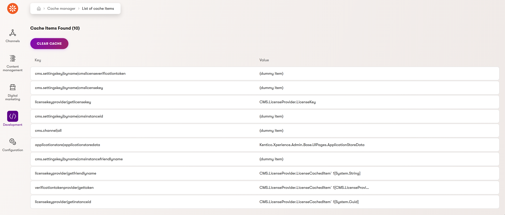
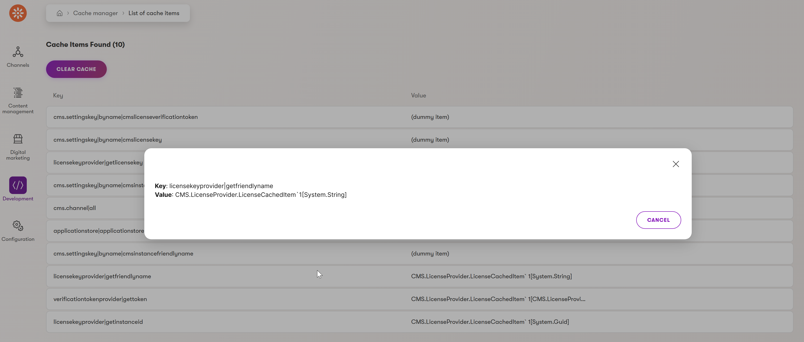

# Xperience Community: Cache Manager

[](https://www.nuget.org/packages/XperienceCommunity.CacheManager) [](https://github.com/vhugogarcia/xperience-community-cache-manager/actions/workflows/build.yml)

## Description

This new module found in the Development category allows users to view and manage cache items within the Kentico Xperience administration UI. The Cache Manager displays all cache items in a table format, allowing administrators to inspect cache contents, view detailed information about individual cache entries, and clear the entire cache when needed.

## Library Version Matrix

| Xperience Version | Library Version |
|-------------------|-----------------|
| >= 29.0.0         | >= 1.0.0        |

> **Note:** The latest version that has been tested is 29.0.0

## ⚙️ Package Installation

Add the package to your application using the .NET CLI

```bash
dotnet add package XperienceCommunity.CacheManager
```

## 🚀 Quick Start

Add the following to your application's startup code:

```csharp
builder.Services.AddCacheManager();
```

Open the new Cache Manager application in the Development category. The module will display all current cache items in a table format.



### Features

- **View Cache Items**: Browse all cache entries with their keys and values
- **Detailed View**: Click on individual cache items to view their full details in a dialog
- **Cache Statistics**: View the total count of cache items
- **Clear Cache**: Clear all cache items with a single action

The results are displayed in a table showing cache keys and values. Click on an individual row to view the full detail of that cache item's content.



## 🤝 Contributing

Contributions are welcome! Please feel free to submit a Pull Request.

## 📄 License

This project is licensed under the MIT License.